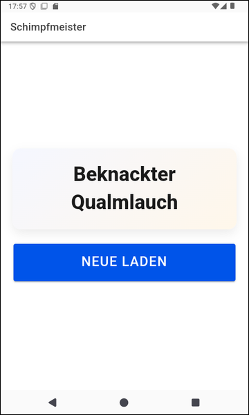
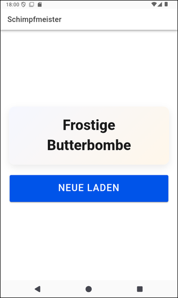

# Ionic-App "Schimpfmeister" #

 

Dieses Repository enthält eine [Ionic-App](https://ionicframework.com/) mit [Angular](https://angular.io/), die demonstriert, wie über REST Daten von einer *Edge Function* auf Supabase abgerufen werden können.
Bei diesen Daten handelt es sich um lustige Schimpfwörter, die mit dem [Schimpfolino](https://github.com/NikolaiRadke/Schimpfolino/)-Algorithmus von 
[Nikolai Radke](https://www.nikolairadke.de/) erzeugt werden.

 

Es gibt auch eine native Android-Implementierung von "Schimpfmeister", die die Schimpfwörter lokal erzeugt,
siehe [dieses Repo](https://github.com/MDecker-MobileComputing/Android_Schimpfmeister).
Eine Version dieser App ist im offizielle Android-App-Store *Google Play* veröffentlicht,
siehe [hier](https://play.google.com/store/apps/details?id=de.mide.android.schimpfmeister).

 

----

## Screenshots ##

 

 &nbsp; 

 

----

## License ##

 

See the [LICENSE file](LICENSE.md) for license rights and limitations (BSD 3-Clause License) for the files in this repository.

 
